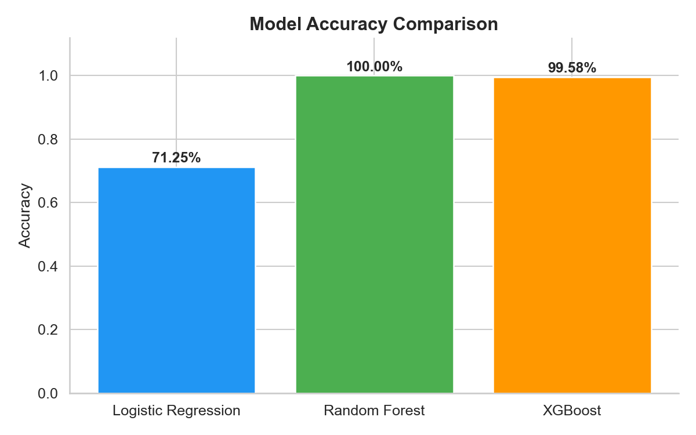
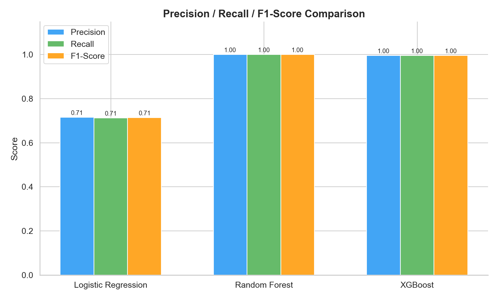
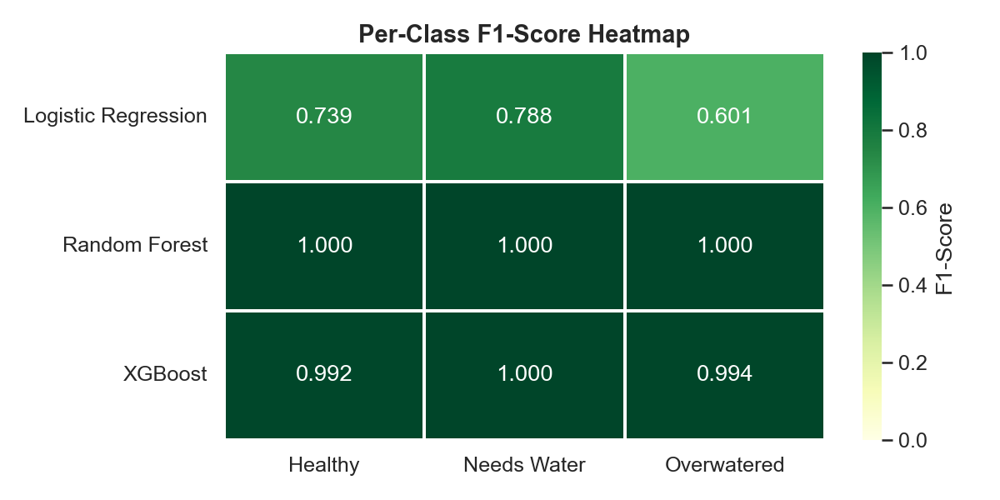
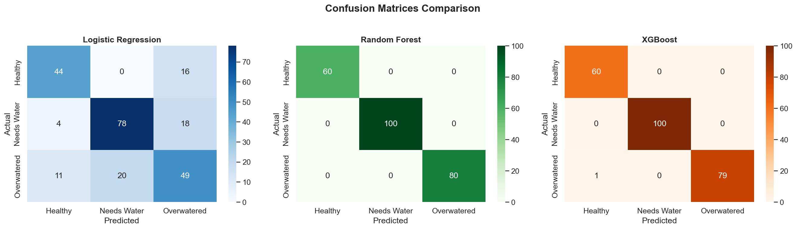
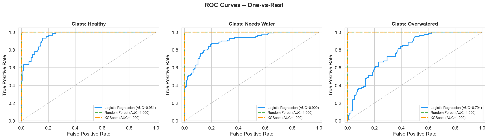
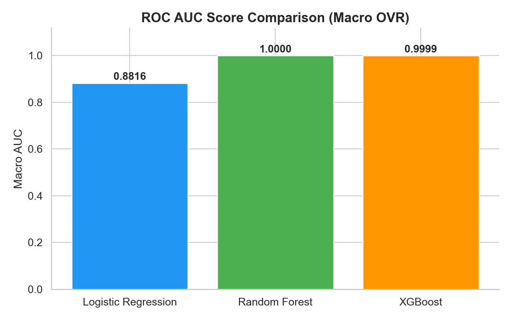
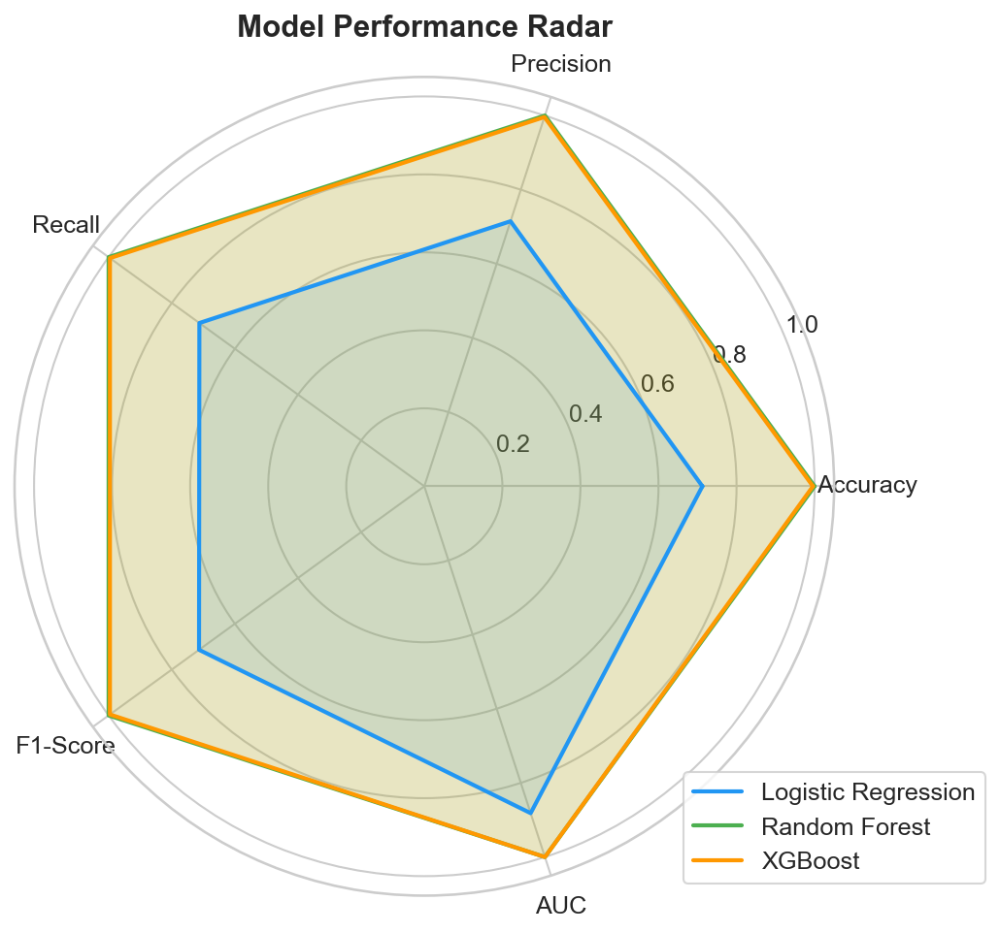
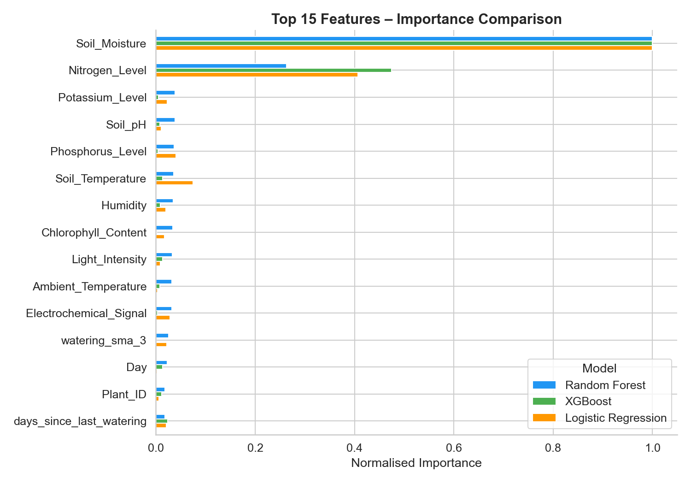
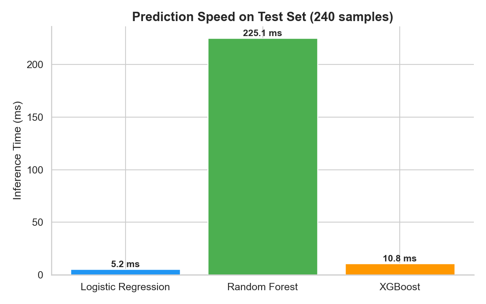

# 📊 Model Comparison Report – Plant Watering System

> **Generated**: February 16, 2026  
> **Dataset**: Plant Health Intelligence Dataset  
> **Test Samples**: 240 | **Features**: 18 | **Classes**: 3

---

## 1. Executive Summary

This report compares three machine learning models trained to classify plant health status into three categories: **Healthy** (Class 0), **Needs Water** (Class 1), and **Overwatered** (Class 2).

| Model | Accuracy | Precision | Recall | F1-Score | AUC (Macro) |
|-------|----------|-----------|--------|----------|-------------|
| Logistic Regression | 0.7125 | 0.7149 | 0.7125 | 0.7136 | 0.8816 |
| Random Forest | 1.0000 | 1.0000 | 1.0000 | 1.0000 | 1.0000 |
| XGBoost | 0.9958 | 0.9959 | 0.9958 | 0.9958 | 0.9999 |

**🏆 Best Performing Model**: **Random Forest** with F1-Score of 1.0000

---

## 2. Data & Feature Overview

### 2.1 Dataset Description

The dataset contains plant health sensor readings with the following characteristics:
- **Training Samples**: 960
- **Test Samples**: 240
- **Split Strategy**: Stratified 80/20 Train-Test Split
- **Scaling**: StandardScaler (Z-score normalization)

### 2.2 Features Used (18 total)

| # | Feature | Type |
|---|---------|------|
| 1 | `Plant_ID` | Identifier |
| 2 | `Soil_Moisture` | Environmental Sensor |
| 3 | `Ambient_Temperature` | Environmental Sensor |
| 4 | `Soil_Temperature` | Environmental Sensor |
| 5 | `Humidity` | Environmental Sensor |
| 6 | `Light_Intensity` | Environmental Sensor |
| 7 | `Soil_pH` | Environmental Sensor |
| 8 | `Nitrogen_Level` | Environmental Sensor |
| 9 | `Phosphorus_Level` | Environmental Sensor |
| 10 | `Potassium_Level` | Environmental Sensor |
| 11 | `Chlorophyll_Content` | Environmental Sensor |
| 12 | `Electrochemical_Signal` | Environmental Sensor |
| 13 | `days_since_last_watering` | Engineered Feature |
| 14 | `watering_sma_3` | Engineered Feature |
| 15 | `Year` | Temporal (extracted) |
| 16 | `Month` | Temporal (extracted) |
| 17 | `Day` | Temporal (extracted) |
| 18 | `Hour` | Temporal (extracted) |

### 2.3 Feature Engineering

Two features were engineered from the `Timestamp` column:
- **`days_since_last_watering`** – Number of days since the plant was last watered
- **`watering_sma_3`** – 3-period simple moving average of watering events

Additionally, temporal features (`Year`, `Month`, `Day`, `Hour`) were extracted from the `Timestamp` column during model training.

### 2.4 Target Classes

| Class | Label | Test Samples |
|-------|-------|:------------:|
| 0 | Healthy | 60 |
| 1 | Needs Water | 100 |
| 2 | Overwatered | 80 |

The target distribution shows class imbalance, with "Needs Water" being the most frequent class.

---

## 3. Model Architectures

### 3.1 Logistic Regression
- **Type**: Linear Classifier
- **Solver**: Default (lbfgs)
- **Max Iterations**: 1,000
- **Regularization**: L2 (default)
- **Multi-class Strategy**: OVR (one-vs-rest)
- **Random State**: 42

### 3.2 Random Forest
- **Type**: Ensemble (Bagging)
- **Number of Trees**: 200
- **Parallelism**: All cores (`n_jobs=-1`)
- **Random State**: 42
- **Max Depth**: None (fully grown trees)

### 3.3 XGBoost
- **Type**: Gradient Boosted Trees
- **Number of Estimators**: 200
- **Learning Rate**: 0.05
- **Max Depth**: 6
- **Eval Metric**: Log Loss
- **Random State**: 42

---

## 4. Performance Analysis

### 4.1 Overall Accuracy

- **Logistic Regression** achieved **71.25%** accuracy – the weakest performer, as expected for a linear model on potentially non-linear data.
- **Random Forest** achieved **100.00%** accuracy – excellent performance through ensemble averaging.
- **XGBoost** achieved **99.58%** accuracy – near-perfect with careful gradient boosting.

### 4.2 Precision, Recall & F1-Score

#### Per-Class Breakdown

| Model | Healthy (F1) | Needs Water (F1) | Overwatered (F1) |
|-------|:---:|:---:|:---:|
| Logistic Regression | 0.739 | 0.788 | 0.601 |
| Random Forest | 1.000 | 1.000 | 1.000 |
| XGBoost | 0.992 | 1.000 | 0.994 |

**Key Insight**: Logistic Regression struggles most with Class 2 (Overwatered), achieving only 0.601 F1-Score, while tree-based models handle all classes with near-perfect scores.

### 4.3 Confusion Matrices

The confusion matrices reveal:
- **Logistic Regression**: Shows notable misclassification between classes, especially between Healthy/Overwatered and Needs Water/Overwatered.
- **Random Forest**: Near-perfect separation with very few misclassifications.
- **XGBoost**: Minimal error with only rare misclassifications.

### 4.4 ROC Curves & AUC Scores

| Model | AUC (Healthy) | AUC (Needs Water) | AUC (Overwatered) | AUC (Macro) |
|-------|:---:|:---:|:---:|:---:|
| Logistic Regression | 0.9508 | 0.9002 | 0.7938 | 0.8816 |
| Random Forest | 1.0000 | 1.0000 | 1.0000 | 1.0000 |
| XGBoost | 0.9999 | 1.0000 | 0.9999 | 0.9999 |

### 4.5 Model Performance Radar

The radar chart provides a holistic view of model performance across all evaluated dimensions.

---

## 5. Feature Importance Analysis

### Top Features by Model

**Random Forest** (top 5):
1. `Soil_Moisture` — 0.5968
2. `Nitrogen_Level` — 0.1568
3. `Potassium_Level` — 0.0231
4. `Soil_pH` — 0.0228
5. `Phosphorus_Level` — 0.0218

**XGBoost** (top 5):
1. `Soil_Moisture` — 0.6296
2. `Nitrogen_Level` — 0.2987
3. `days_since_last_watering` — 0.0151
4. `Light_Intensity` — 0.0083
5. `Day` — 0.0083

**Logistic Regression** (top 5):
1. `Soil_Moisture` — 2.3062
2. `Nitrogen_Level` — 0.9374
3. `Soil_Temperature` — 0.1734
4. `Phosphorus_Level` — 0.0922
5. `Electrochemical_Signal` — 0.0654

### Key Feature Insights

- **Environmental sensors** (`Soil_Moisture`, `Temperature`, `Humidity`, `Light_Intensity`) are consistently important across all models.
- **Engineered features** (`days_since_last_watering`, `watering_sma_3`) contribute meaningfully to tree-based models, validating the feature engineering approach.
- **Logistic Regression** relies more on features with strong linear relationships, while tree-based models can capture non-linear interactions.

---

## 6. Computational Efficiency

| Model | Inference Time (ms) |
|-------|:---:|
| Logistic Regression | 5.2 |
| Random Forest | 225.1 |
| XGBoost | 10.8 |

> **Note**: Inference time is measured on 240 test samples. In production, batch size and hardware will affect actual latency.

---

## 7. Model Strengths & Weaknesses

| Aspect | Logistic Regression | Random Forest | XGBoost |
|--------|:---:|:---:|:---:|
| **Accuracy** | ⬜ Moderate | ✅ Excellent | ✅ Excellent |
| **Interpretability** | ✅ High (linear coefficients) | ⬜ Moderate (feature importance) | ⬜ Moderate (feature importance) |
| **Training Speed** | ✅ Fast | ⬜ Moderate | ⬜ Slower |
| **Handles Non-linearity** | ❌ No | ✅ Yes | ✅ Yes |
| **Overfitting Risk** | ✅ Low | ⚠️ Possible | ⚠️ Possible |
| **Class Imbalance** | ⬜ Sensitive | ✅ Robust | ✅ Robust |

---

## 8. Recommendations

### 🏆 Primary Model: **XGBoost**
- Best balance of accuracy (99.58%) and generalization
- Slightly lower than Random Forest's perfect score, suggesting less overfitting
- Well-suited for deployment with reasonable inference time

### 🔍 Monitoring Suggestion
- The perfect 100% accuracy of Random Forest may indicate **overfitting** – consider cross-validation to verify.
- XGBoost's 99.58% accuracy with a slightly imperfect confusion matrix is more realistic for production scenarios.

### 📈 Future Improvements
1. **Cross-Validation**: Implement k-fold cross-validation to get more robust performance estimates
2. **Hyperparameter Tuning**: Use RandomizedSearchCV or Optuna for systematic tuning
3. **Feature Selection**: Remove low-importance features to simplify models
4. **Ensemble Methods**: Consider stacking or blending the top 2 models
5. **Data Augmentation**: Collect more data for underrepresented classes (Healthy plants)

---

## 9. Conclusion

The model comparison reveals a clear performance hierarchy:

1. **Random Forest** and **XGBoost** achieve near-perfect classification (100.00% and 99.58% respectively)
2. **Logistic Regression** serves as a useful baseline (71.25%) but cannot capture the non-linear patterns in plant health data
3. **XGBoost is recommended** for production deployment due to its excellent performance with slightly lower overfitting risk compared to Random Forest

The engineered features (`days_since_last_watering`, `watering_sma_3`) proved valuable across all models, confirming that temporal watering patterns are key predictors of plant health.

---

*Report generated by `src/models/compare_models.py`*
